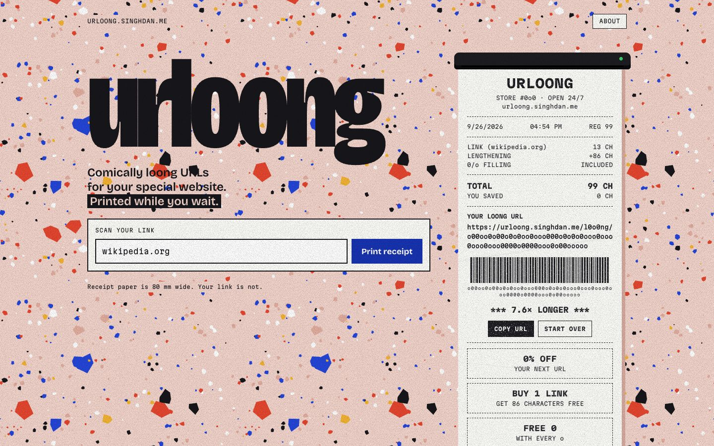
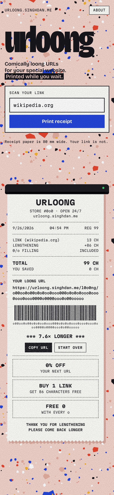

<p align="center"></p>

<h1 align="center">urloong</h1>

<p align="center">The internet has way too many URL shorteners, so this is a URL longener.<br>
<a href="https://urloong.singhdan.me"><b>urloong.singhdan.me</b></a></p>

<br>

Paste a link, and urloong prints you a receipt with a much longer one:

```
singhdan.me  →  https://urloong.singhdan.me/l0o0ng/oo00ooo0oo000ooooo00oo0000oo0oo00o0oo00o0oo00o0oo0oo000o0000o000
```

It still works. Open the long link and it redirects to the original, which is the least a URL service can do.

<table>
  <tr>
    <td width="72%"></td>
    <td width="28%"></td>
  </tr>
</table>

## How the long part is made

The link is trimmed to its host, path and query, so `http://`, `https://` and trailing slashes don't change anything. That string is hashed with SHA-256, and each of the 64 hex characters becomes a `0` if it's even or an `o` if it's odd. So the same link always gets the same long URL, and saving it twice doesn't create a duplicate.

## Running it locally

You need Node 24 and a free [Neon](https://neon.com) Postgres database.

```bash
cp l0o0ng/.env.example l0o0ng/.env   # then paste your Neon connection string into it
npm --prefix l0o0ng install
npm --prefix l0o0ng run db:setup     # creates the one table
npm --prefix l0o0ng start            # backend on :3001
```

In a second terminal:

```bash
npm --prefix client install
npm --prefix client run dev          # site on :3000, proxies /l0o0ng to the backend
```

## What's where

| Path | What it is |
|---|---|
| `client/` | The Next.js site. `components/UrlLongifier.js` is the form and the receipt it prints. |
| `l0o0ng/` | The Express backend: creates long links and redirects them. `schema.sql` is the whole database. |
| `client/design/` | HTML sources for the link-preview image and app icon, with instructions to regenerate them. |
| `vercel.json` | Sends `/l0o0ng/*` to the backend and everything else to the site. |

It's hosted on Vercel, and every push to `main` deploys. The backend needs `DATABASE_URL` set in the Vercel project.

## Contact

Found a bug, or want an even longer URL? singhdan [at] iu [dot] edu. More of my projects at [singhdan.me](https://singhdan.me).
